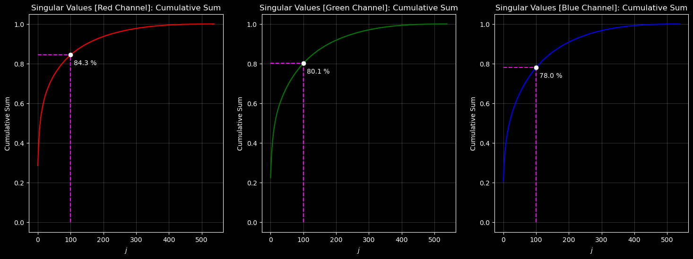

# Image Compression using Singular Value Decomposition

## Introduction
This project is about compressing an image using singlular value decomposition in python. The singular value decomposition produces three tensors $U$, $S$ and $V^T$ where $U$ is an $m \times m$ array, the columns (vectors) of this array are called 'Left Singular Vectors'. $S$ is an $(m \times n)$ array and is a diagonal matrix containing the singular values of the original matrix. $V^T$ is a $n \times n$ array, the rows of this array are called 'Right Singular Vectors'.
## Objective
The next step is to find a lower rank approximation of the image using a certain rank and matrix multiplications. Higher the value of rank, the closer the approximated image is to the original image.

## Results
The compressed image is visualized at different ranks providing an intuition as to how changing the rank, affects the quality of the image. A graph of singular values $\sigma_j$ in logarithmic scale vs index of the singular values $j$ is plotted to visualize the relative differences between singular values. Another graph where Cumulative Sum vs index of the singular values $j$ is plotted to visualize the contribution of each singular value to the total variance or energy of the matrix. The Cumulative Sum curve shows how much the total variance is captured by including the first $j$ singular values.

Compression on colored images is experimented in 'Colored.ipynb' Jupyter Notebook.

## Usage
This project is available as a web service hosted on Streamlit Community Cloud and can be accessed by anyone for free through this link: [ImageSVD](https://imagesvd.streamlit.app/).